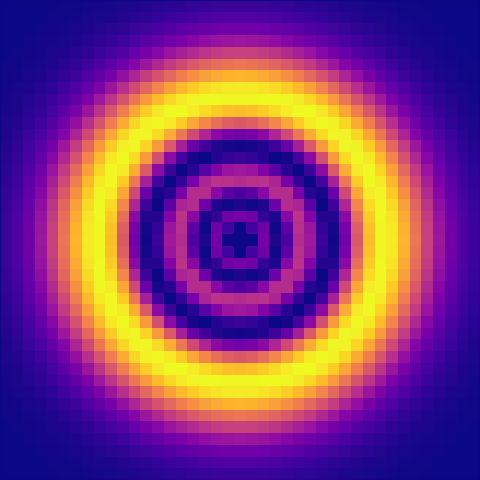
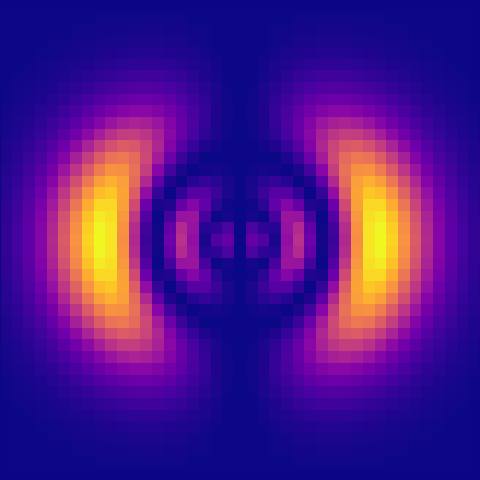
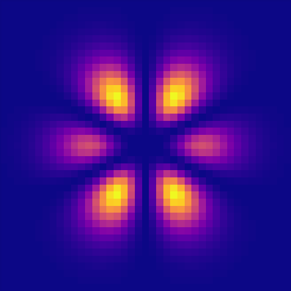
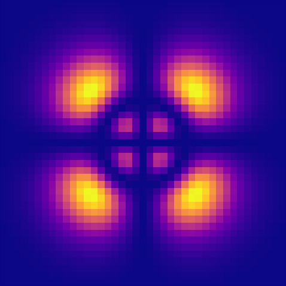

# Atomic Orbitals in Minecraft!

I-I wish I had an actual explanation about how they work... they just look cool!

### TODO

- Vectorize computations
- Script for a possible video

### Resources

- Mathematica version by [Paul Nylander](http://bugman123.com/Physics)
- Rust version by [cbeuw](https://github.com/cbeuw/iiiD6) (not really used for this project, but I love its Laguerre implementation)
- [Atomic Orbital](https://en.wikipedia.org/wiki/Atomic_orbital)
- [Hydrogen Wave Function](https://en.wikipedia.org/wiki/Hydrogen_atom#Wavefunction)
- [Generalized Laguerre Polynomials (idk)](https://en.wikipedia.org/wiki/Laguerre_polynomials#Generalized_Laguerre_polynomials)

### Galery

